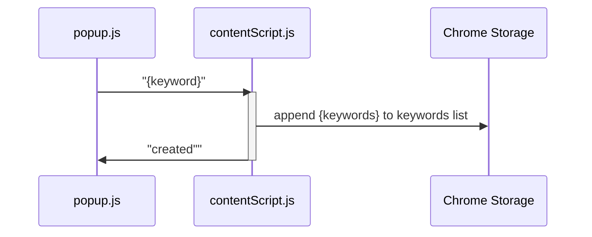
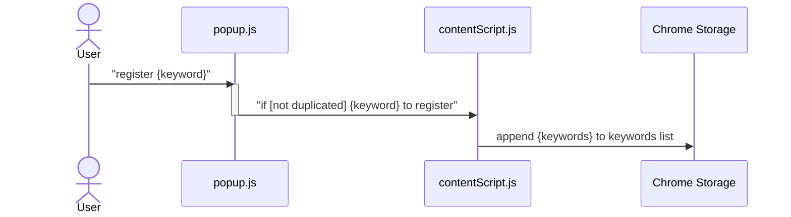
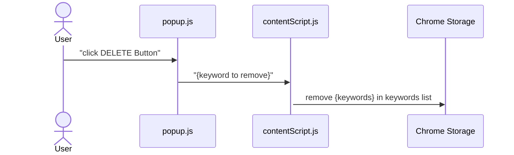

# Shorts Filtering Extension

> 해당 익스텐션은 DOM API로 쇼츠 태그에 접근할 수 없어 불가피하게 개발이 중단됐다. (2024-03-18 ~ 2024.03.21)
> popup에서 키워드를 저장하고 삭제하면, Chrome Storage에도 반영되는 것까지 개발됐다. (필터링 기능 제외 전부가 구현됨)

## 개발 과정 목차

1. [Shorts HTML 구조 파악](#1-shorts-html-구조-파악)
2. [popup 생성](#2-popup-생성)
3. [기본 manifest.json 작성](#3-기본-manifestjson-작성)
4. [popup에서 입력한 키워드를 contentScript에 전달](#4-popup에서-입력한-키워드를-contentscript에-전달)
5. [popup에서 등록한 키워드를 Chrome Storage에 저장](#5-popup에서-등록한-키워드를-chrome-storage에-저장)
6. [popup에서 삭제한 키워드를 Chrome Storage에서 삭제](#6-popup에서-삭제한-키워드를-chrome-storage에서-삭제)
7. [유튜브 태그가 인식되지 않는 문제 발생](#7-유튜브-태그가-인식되지-않는-문제-발생)
8. [개발 중단... => 새로운 익스텐션을 만들자](#8-개발-중단--새로운-익스텐션을-만들자)

- [이슈](#이슈)

## 1. Shorts HTML 구조 파악


처음 쇼츠를 재생하면, `#shorts-container` > `shorts-inner-container`의 자식 태그로 `ytd-reel-video-renderer` 10개가 생성된다. 이것이 바로 쇼츠들 목록이고, 9번째 쇼츠에 접근하면 추가로 10개의 자식 태그가 삽입되는 형태이다.


`ytd-reel-video-renderer` 태그 안에는 쇼츠 제목과 링크된 영상 제목 등의 정보가 포함된다. 각 태그를 자세히 보면 다음과 같다.

- 제목: `<h2 class="title style-scope reel-player-header-renderer"></h2>`


- 링크된 영상 제목: `<div id="reel-multi-format-link-view-model" class="style-scope reel-player-header-renderer"></div>`


이를 토대로 크롬 개발자 도구를 통해 실제 쇼츠 제목과 링크된 영상 제목에 접근해보자.


overlays라는 배열에 각 쇼츠들의 종합 정보를 담고, 1번 인덱스의 쇼츠 제목과 링크된 영상 제목을 알아내는 데 성공했다. 이 디버깅을 잘 기억하고, 자바스크립트 코드를 작성하면 되겠다.

## 2. popup 생성

| 초기화면                                                                               | 키워드 등록                                                                            |
| -------------------------------------------------------------------------------------- | -------------------------------------------------------------------------------------- |
|  |  |

확장 프로그램 작업(툴바 아이콘)을 클릭하면 왼쪽 초기화면, 즉 팝업이 생성되고 키워드를 입력 후 `Register` 버튼을 클릭하면 하단 키워드 리스트에 추가된다.

아직 크롬 API와 연결되진 않았기 때문에 팝업을 닫았다가 다시 열면 기존 데이터는 모두 사라지며, 쇼츠에서 필터링되지도 않는다.

## 3. 기본 manifest.json 작성

```json
{
	"manifest_version": 3,
	"name": "Shorts Filter",
	"version": "1.0.0",
	"description": "You can pass shorts that include keywords you registered automatically",
	"icons": {
		"16": "assets/icon_16.png",
		"32": "assets/icon_32.png",
		"48": "assets/icon_48.png",
		"128": "assets/icon_128.png"
	},
	"action": {
		"default_icon": "assets/icon_32.png",
		"default_title": "Shorts Filter",
		"default_popup": "popup.html"
	}
}
```

"actions" > "default_title"을 설정하지 않으면, 확장 프로그램을 클릭했을 때 익스텐션의 이름이 연한 회색으로 `name`에 작성된 글자가 나온다.

## 4. popup에서 입력한 키워드를 contentScript에 전달

> contentScript는 현재 크롬 탭의 DOM에 접근할 수 있다. 따라서 현재 화면의 HTML 구조를 파악하고 querySelector()로 가져오는 등의 작업을 하려면 contentScript가 필요하다.

### manifest.json에 permissions와 host_permissions, content_scripts와 추가

```json
{
	"permissions": ["activeTab", "tabs", "storage"],
	"host_permissions": ["https://*.youtube.com/shorts/*"],
	"content_scripts": [
		{
			"matches": ["https://*.youtube.com/shorts/*"],
			"js": ["javascript/contentScript.js"]
		}
	]
}
```

- `activeTab`: 현재 active한 탭 정보를 알아내기 위해 필요한 권한
- `tabs`: 크롬 창에 띄워진 모든 탭 정보를 알아내기 위한 권한 (아마도)
- `storage`: 데이터를 저장하기 위한, 구글이 제공하는 스토리지 사용 권한
- `host_permissions`: permissions를 요청하는 호스트
- `content_scripts`: 패턴과 일치하는 탭에서 등록한 자바스크립트 파일 실행

### 간단한 테스트

```javascript
// popup.js : 다른 코드들은 생략
const getCurrentTab = async () => {
	const [tab] = await chrome.tabs.query({ active: true, currentWindow: true });
	return tab;
};
const currentTab = await getCurrentTab();
const currentURL = currentTab.url;
chrome.tabs.sendMessage(currentTab.id, {
	type: 'register',
	keyword,
});

// contentScript.js
chrome.runtime.onMessage.addListener(async (message) => {
	alert(JSON.stringify(message));
});
```

popup에서 키워드 `example`을 입력하면, contentScript에 전달되고 이곳에서 chrome.storage.sync에 키워드를 저장할 계획이다.

본격적으로 개발하기 전에, 일단 popup에서 입력한 내용을 contentScript에서 받아서 alert()로 출력하는 간단한 코드를 작성했다. 처음 개발하는 크롬 확장 프로그램이기 때문에 한 단계씩 진행하기 위함이다.


실행 결과는 성공적! 이제 제대로 개발해보자.

## 5. popup에서 등록한 키워드를 Chrome Storage에 저장



새로운 키워드를 등록하는 방법을 시퀀스 다이어그램으로 나타내면 위와 같다.

popup.js에서 contentScript.js에 메시지를 전달하기 위해 `tabs API`의 sendMessage()를 사용한다.
contentScript.js는 `chrome.runtime.onMessage.addListener()`를 통해 메시지가 들어오면 이를 읽는다. addListener()는 3개의 인자를 가지는데, 그 중 마지막 sendResponse 인자를 통해 메시지를 보낸 sender에게 응답 메시지를 전달할 수 있다.

```javascript
// popup.js (유효한 키워드가 입력됐을 때의 코드)
if (!!keyword) {
	chrome.tabs.sendMessage(
		currentTab.id,
		{
			type: 'register',
			keyword,
		},
		(response) => {
			const { statusCode } = response;

			if (statusCode == 201) {
				appendKeywordNode(keywordList, keyword);
				console.log(`** ${statusCode}`); // for test
			} else {
				console.log(`** ${keyword} not registered`);
			}
		}
	);
}

// contentScript.js
const fetchData = () => {
	return (await chrome.storage.sync.get('keywords')).keywords ?? [];
};

const register = async (keyword) => {
	const keywords = await fetchData();
	const isDuplicated = keywords.some((word) => word === keyword);

	if (isDuplicated) {
		return;
	}

	chrome.storage.sync.set({ keywords: [...keywords, keyword] });
};

chrome.runtime.onMessage.addListener(async (message, sender, sendResponse) => {
	const { type, keyword } = message;

	if (type === 'register') {
		await register(keyword);
		sendResponse({ statusCode: 201, message: 'Created' });
	}
});
```


popup에서 contentScript로 데이터도 잘 보내고, contentScript에서 popup으로 응답도 잘 전송한다! 그러나 이 상태론 팝업을 껐다가 다시 켰을 때, 기존에 등록한 키워드가 보이지 않을 것이다. 저장하기만 하고, popup에서 기존 데이터를 불러오는 과정이 아직 구현되지 않았기 때문이다.

```javascript
// popup.js
const fetchData = () => {
	return (await chrome.storage.sync.get('keywords')).keywords ?? [];
};

const keywordList = document.querySelector('#keyword-list');

const keywords = await fetchData();
keywords.forEach((word) => {
	appendKeywordNode(keywordList, word);
});
```

위 코드를 popup.js에 추가로 작성하면, 이제 팝업을 껐다가 켜도 기존에 등록한 데이터가 잘 출력된다.

코드를 자세히 보면 Chrome Storage에서 데이터를 가져오는 fetchData 함수는 contentScript.js에 작성된 함수와 동일하다. utils.js 같은 파일을 생성하고 fetchData를 각각 import 해서 사용하면 좋겠지만, **_contentScript.js에서는 import가 허용되지 않는다._**

사실 이것 때문에 애를 좀 먹었는데, 그 삽질 과정은 [여기](#contentscript는-export-키워드가-있으면-안-돼요)에 따로 정리했다.

... 그리고 개발을 하다 보니, 다음과 같이 코드가 수정됐는데 이 코드는 크나큰 문제가 있었다.

```javascript
const register = async (keyword) => {
	const keywords = await fetchData();
	const isDuplicated = keywords.some((word) => word === keyword);

	if (isDuplicated) {
		return { statusCode: 409, message: 'Conflict' };
	}

	chrome.storage.sync.set({ keywords: [...keywords, keyword] });
	return { statusCode: 201, message: 'Created' };
};

chrome.runtime.onMessage.addListener(async (message, sender, sendResponse) => {
	const { type, keyword } = message;

	if (type === 'register') {
		const result = await register(keyword);
		sendResponse(result);
	}
});
```

어떤 방법을 써도 `sendResponse(result)`로 popup한테 응답을 보내려고 해도, popup에겐 result가 `undefined`였다. result가 초기화되기 전에 sendResponse()가 실행되는 것 같은데, 정말... popup 쪽에 async를 붙여도 보고 괜히 Promise로 바꿔도 보고, addListener() 안에서 `return true;`를 작성해 봤지만 다 안 됐다.

따라서... popup이 contentScript의 응답이 필요하지 않게끔 로직을 조금 수정했다.



- 기존: popup에서 무조건 contentScript로 keyword 전달 → contentScript에서 중복 여부 검사 후 storage에 저장하고 응답 → popup이 응답을 보고 201이면 새 HTML Element 추가 아니면 추가 안 함
- 변경: popup에서 keyword 중복 검사 후, 중복이 아닐 때만 새 HTML Element 추가 및 contentScript로 전달 → contentScript는 무조건 storage에 저장

```javascript
// popup.js
const keywordList = document.querySelector('#keyword-list');

let keywords = await fetchData();
keywords.forEach((word) => {
	appendKeywordNode(keywordList, word);
});

registerBtn.addEventListener('click', () => {
	const keywordInput = form.querySelector('#input-keyword');
	const keyword = keywordInput.value.trim();

	if (!!keyword) {
		const isDuplicated = keywords.some((word) => word === keyword); // 중복 검증

		if (!isDuplicated) {
			keywords = [...keywords, keyword];
			appendKeywordNode(keywordList, keyword);
			chrome.tabs.sendMessage(currentTab.id, {
				type: 'register',
				keyword,
			});
		}
	}

	keywordInput.value = '';

	// contentScript.js
	const fetchData = async () => {
	return (await chrome.storage.sync.get('keywords')).keywords ?? [];
};

const register = async (keyword) => {
	const keywords = await fetchData();
	chrome.storage.sync.set({ keywords: [...keywords, keyword] });
};

chrome.runtime.onMessage.addListener(async (message, sender, sendResponse) => {
	const { type, keyword } = message;

	if (type === 'register') {
		await register(keyword);
	}
});
```

## 6. popup에서 삭제한 키워드를 Chrome Storage에서 삭제

이제 팝업에서 키워드 삭제 버튼을 클릭했을 때, Chrome Storage에 저장된 데이터에까지 해당 키워드가 삭제되도록 해보자. 방법은 간단하다.



```javascript
// popup.js : 키워드 삭제 버튼의 EventListener
deleteBtn.addEventListener('click', async () => {
	list.removeChild(node);

	const currentTab = await getCurrentTab();
	chrome.tabs.sendMessage(currentTab.id, {
		type: 'remove',
		keyword: node.querySelector('span').value,
	});
});

// contentScript.js
const remove = async (keyword) => {
	const keywords = await fetchData();
	const index = keywords.indexOf(keyword);
	keywords.splice(index, 1);
	chrome.storage.sync.set({ keywords: keywords });
};
```

## 7. 유튜브 태그가 인식되지 않는 문제 발생

```javascript
const pageManager = document.querySelector('#page-manager');
console.log(pageManager);
console.log(pageManager.childNodes);
console.log(pageManager.childNodes.length);
console.log(pageManager.childNodes[3]);
const shortsContainer = pageManager.querySelector('#shorts-container');
console.log(shortsContainer);
```


아주 난감하다. [Shorts HTML 구조 파악](#1-shorts-html-구조-파악)에서 알아낸 내용을 전혀 사용할 수가 없다. 크롬 개발자 도구에선 가능했지만, 자바스크립트로 접근하려니까 되지 않는다.

위 캡처본에서 NodeList의 3번째 원소인 `ytd-shorts` 노드 안에 `#shorts-container`가 있고, 그 안에 쇼츠들이 정렬되어 있다. 그래서 현재 쇼츠 (`is-active`)가 무엇인지 파악하고, 이곳에 필터링 키워드가 포함되어 있는지 확인한 다음에 다음 쇼츠로 넘어가야 한다. 그런데 태그를 가져올 수가 없다. 어떡하지?

## 8. 개발 중단... => 새로운 익스텐션을 만들자.

... 이것 대신 다른 익스텐션을 만들기로 했다. 쇼츠를 키워드 필터링하는 익스텐션 말고도, N회 이상 쇼츠를 감상하면 더 이상 쇼츠를 보지 못하도록 막는 익스텐션도 만들고 싶었다. 상황이 여의치 않으니, N회 이상 쇼츠 시청 차단 익스텐션을 만들어보겠다!

## 이슈

### contentScript는 export 키워드가 있으면 안 돼요

> 추후 오류 메시지 캡처 등 내용 보완 예정

대략적으론 utils.js 파일에 fetchData를 생성하면, export 키워드가 붙어야지 popup.js 파일에서 import 해서 사용할 수 있다.
그러나 contentScript.js에서 다른 자바스크립트 파일의 함수를 사용하려면 해당 함수에 export 키워드가 있어선 안 된다! contentScript.js가 다른 파일의 함수에 액세스할 수 있는 이유는 manifest.json에서 사용하는 파일들을 정의해놓기 때문이다.

```json
"content_scripts": [
	{
		"matches": ["https://*.youtube.com/shorts/*"],
		"js": ["javascript/contentScript.js", "javascript/utils.js"]
	}
]
```
